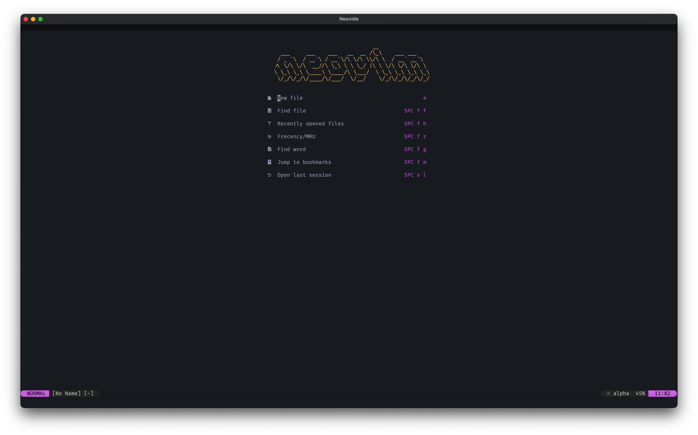
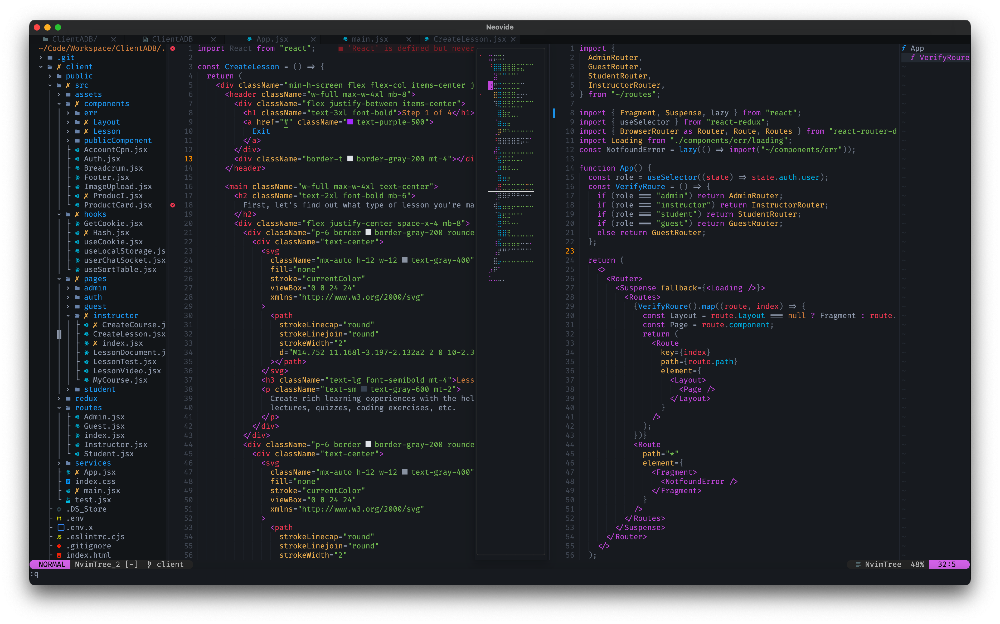
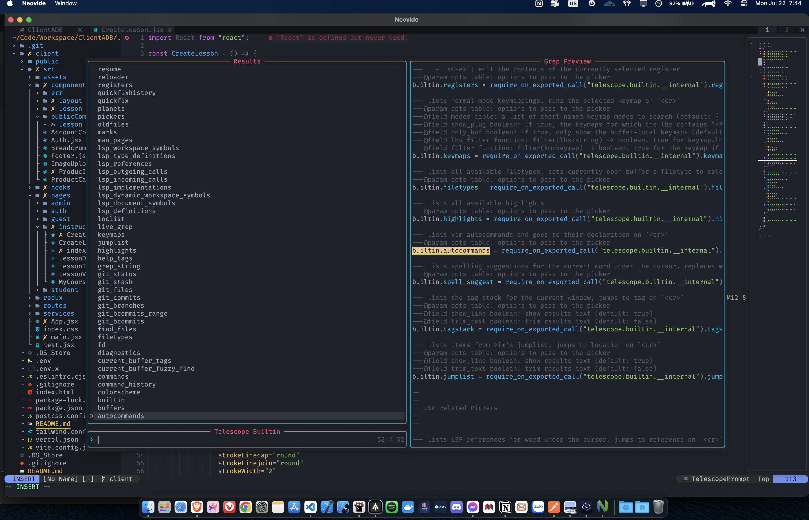

<div align="center">

# Nvim


<p align="center">
  <a href="https://github.com/pojokcodeid/nvim-lazy/pulse">
    
  </a>
  <a href="https://github.com/pojokcodeid/nvim-lazy/latest">
    
  </a>
  <a href="https://github.com/pojokcodeid/nvim-lazy/stargazers">
    
  </a>
  <a href="https://github.com/pojokcodeid/nvim-lazy/blob/main/LICENSE"></a>
  <a href="https://github.com/pojokcodeid/nvim-lazy/issues">
  
    </a>
  </a>
  <a href="https://github.com/pojokcodeid/nvim-lazy">
      
    </a>
    <a href="https://twitter.com/intent/follow?screen_name=pojokcodeid_">
      
    </a>
</p>

</div>

## HOME



## Transparant



## Demo



## Treesitter dan LSP


<!-- ## Layout -->

<!--  -->

# NeoVim Install & Configuration Guide


# Linux / Macos (unix)


:warning: Backup your configuration before installation

```bash
$ cd $HOME && git clone https://github.com/cavaldos/dotfiles
$ cd dotfiles
$ ./install.sh
```

# Uninstall

```bash
# Linux / Macos (unix)
rm -rf ~/.config/nvim
rm -rf ~/.local/share/nvim
```

## Visit <a href="https://github.com/pojokcodeid/nvim-lazy/wiki/">Wiki</a>

## Basic Requirement

2. Install Neovim 0.95+ https://github.com/neovim/neovim/releases/tag/stable
3. C++ https://www.msys2.org/
4. GIT https://git-scm.com/download/win
5. NodeJs https://nodejs.org/en/
6. Ripgrep https://github.com/BurntSushi/ripgrep
7. Lazygit https://github.com/jesseduffield/lazygit
8. Nerd Font https://www.nerdfonts.com/ or https://github.com/ryanoasis/nerd-fonts
9. Windows Terminal (Windows) https://apps.microsoft.com/store/detail/windows-terminal/9N0DX20HK701?hl=en-id&gl=id
10. Powershell (windows) https://apps.microsoft.com/store/detail/powershell/9MZ1SNWT0N5D?hl=en-id&gl=id


<!--License -->
## License

This project is licensed under the MIT License - see the [LICENSE]
